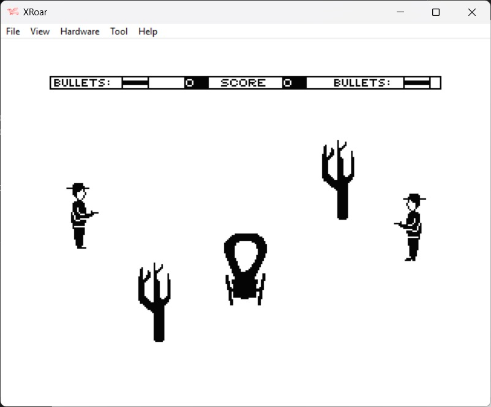

This is a 6809 assembly language two player arcade game for the Dragon 32.  The object of the game is to shoot the opposing cowboy.  Both cowboys are controlled by the left and right joysticks.

The program was written by Joanthan McGowen and originally published in the Dragon User April 1987 edition of Dragon User.  An emendment was later publish in the June 1987 edition.
I have rearranged much of the assembly code to remove the unused memory segments which I hope will make it more readable.

| File | Description |
| --- | --- |
| build.bat |  A windows batch file to assemble and run the program file.  1.  Set the path to asm6809 and XROAR (change as required)    2.  Assemble the code file using asm6809   3.  Run the resulting HighNoon.bin file in XROAR |
| HighNoon.asm | The assembly code file |
| HighNoon.cas | The assembled game file. |

Please note, asm6809 and XROAR(and associated ROMS) are not included, but can be downloaded from the following locations: 
https://www.6809.org.uk/xroar/   https://www.6809.org.uk/asm6809/

To run the game without assembling the code file:
+ Download HighNoon.cas to your device
+ Open a browser and paste the following URL:  https://www.6809.org.uk/xroar/online/
+ Under the emulation screen, click the File tab
+ Click the load button, and select the downloaded HighNoon.cas
+ In the emulation screen, type the following: CLOADM:EXEC   <press enter>
                

